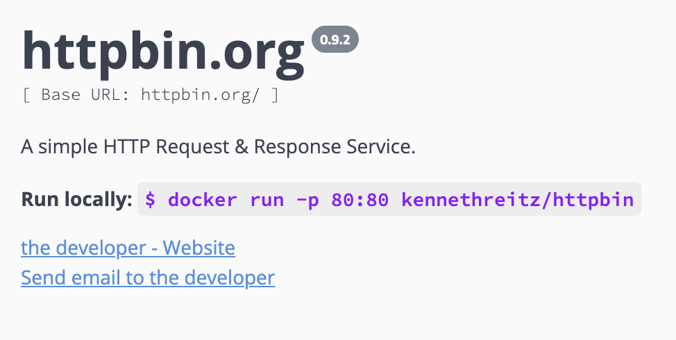

<div align="left">

[](https://httpbin.org)

# [Httpbin](https://httpbin.org)

A simple HTTP Request & Response Service.<br/> <br/> <b>Run locally: </b> <code>$ docker run -p 80:80 kennethreitz/httpbin</code>

</div>

## Requirements

Building the API client library requires:

1. Java 1.8+
2. Maven (3.8.3+)/Gradle (7.2+)

If you are adding this library to an Android Application or Library:

3. Android 8.0+ (API Level 26+)

## Installation<a id="installation"></a>
<div align="center">
  <a href="https://konfigthis.com/sdk-sign-up?company=httpbin&language=Java">
    
  </a>
</div>

### Maven users

Add this dependency to your project's POM:

```xml
<dependency>
  <groupId>com.konfigthis</groupId>
  <artifactId>httpbin-java-sdk</artifactId>
  <version>0.9.2</version>
  <scope>compile</scope>
</dependency>
```

### Gradle users

Add this dependency to your `build.gradle`:

```groovy
// build.gradle
repositories {
  mavenCentral()
}

dependencies {
   implementation "com.konfigthis:httpbin-java-sdk:0.9.2"
}
```

### Android users

Make sure your `build.gradle` file as a `minSdk` version of at least 26:
```groovy
// build.gradle
android {
    defaultConfig {
        minSdk 26
    }
}
```

Also make sure your library or application has internet permissions in your `AndroidManifest.xml`:

```xml
<!--AndroidManifest.xml-->
<?xml version="1.0" encoding="utf-8"?>
<manifest xmlns:android="http://schemas.android.com/apk/res/android"
    xmlns:tools="http://schemas.android.com/tools">
    <uses-permission android:name="android.permission.INTERNET"/>
</manifest>
```

### Others

At first generate the JAR by executing:

```shell
mvn clean package
```

Then manually install the following JARs:

* `target/httpbin-java-sdk-0.9.2.jar`
* `target/lib/*.jar`

## Getting Started

Please follow the [installation](#installation) instruction and execute the following Java code:

```java
import com.konfigthis.client.ApiClient;
import com.konfigthis.client.ApiException;
import com.konfigthis.client.ApiResponse;
import com.konfigthis.client.Httpbin;
import com.konfigthis.client.Configuration;
import com.konfigthis.client.model.*;
import com.konfigthis.client.api.AnythingApi;
import java.util.List;
import java.util.Map;
import java.util.UUID;

public class Example {
  public static void main(String[] args) {
    Configuration configuration = new Configuration();
    configuration.host = "https://httpbin.org";
    Httpbin client = new Httpbin(configuration);
    try {
      client
              .anything
              .getAnything()
              .execute();
    } catch (ApiException e) {
      System.err.println("Exception when calling AnythingApi#getAnything");
      System.err.println("Status code: " + e.getStatusCode());
      System.err.println("Reason: " + e.getResponseBody());
      System.err.println("Response headers: " + e.getResponseHeaders());
      e.printStackTrace();
    }

    // Use .executeWithHttpInfo() to retrieve HTTP Status Code, Headers and Request
    try {
      client
              .anything
              .getAnything()
              .executeWithHttpInfo();
    } catch (ApiException e) {
      System.err.println("Exception when calling AnythingApi#getAnything");
      System.err.println("Status code: " + e.getStatusCode());
      System.err.println("Reason: " + e.getResponseBody());
      System.err.println("Response headers: " + e.getResponseHeaders());
      e.printStackTrace();
    }
  }
}

```

## Documentation for API Endpoints

All URIs are relative to *https://httpbin.org*

Class | Method | HTTP request | Description
------------ | ------------- | ------------- | -------------
*AnythingApi* | [**getAnything**](docs/AnythingApi.md#getAnything) | **DELETE** /anything/{anything} | Returns anything passed in request data.
*AnythingApi* | [**getData**](docs/AnythingApi.md#getData) | **GET** /anything | Returns anything passed in request data.
*AnythingApi* | [**getData_0**](docs/AnythingApi.md#getData_0) | **DELETE** /anything | Returns anything passed in request data.
*AnythingApi* | [**getData_1**](docs/AnythingApi.md#getData_1) | **PATCH** /anything | Returns anything passed in request data.
*AnythingApi* | [**getData_2**](docs/AnythingApi.md#getData_2) | **GET** /anything/{anything} | Returns anything passed in request data.
*AnythingApi* | [**getPassedData**](docs/AnythingApi.md#getPassedData) | **TRACE** /anything | Returns anything passed in request data.
*AnythingApi* | [**getPassedData_0**](docs/AnythingApi.md#getPassedData_0) | **TRACE** /anything/{anything} | Returns anything passed in request data.
*AnythingApi* | [**postRequestData**](docs/AnythingApi.md#postRequestData) | **POST** /anything | Returns anything passed in request data.
*AnythingApi* | [**putRequestData**](docs/AnythingApi.md#putRequestData) | **PUT** /anything | Returns anything passed in request data.
*AnythingApi* | [**returnData**](docs/AnythingApi.md#returnData) | **PUT** /anything/{anything} | Returns anything passed in request data.
*AnythingApi* | [**returnRequestData**](docs/AnythingApi.md#returnRequestData) | **POST** /anything/{anything} | Returns anything passed in request data.
*AnythingApi* | [**updateAnythingData**](docs/AnythingApi.md#updateAnythingData) | **PATCH** /anything/{anything} | Returns anything passed in request data.
*AuthApi* | [**digestAuthPrompt**](docs/AuthApi.md#digestAuthPrompt) | **GET** /digest-auth/{qop}/{user}/{passwd} | Prompts the user for authorization using Digest Auth.
*AuthApi* | [**promptAuthorization**](docs/AuthApi.md#promptAuthorization) | **GET** /bearer | Prompts the user for authorization using bearer authentication.
*AuthApi* | [**promptAuthorizationUsingDigest**](docs/AuthApi.md#promptAuthorizationUsingDigest) | **GET** /digest-auth/{qop}/{user}/{passwd}/{algorithm}/{stale_after} | Prompts the user for authorization using Digest Auth + Algorithm.
*AuthApi* | [**promptAuthorizationUsingHttpGet**](docs/AuthApi.md#promptAuthorizationUsingHttpGet) | **GET** /basic-auth/{user}/{passwd} | Prompts the user for authorization using HTTP Basic Auth.
*AuthApi* | [**promptUserAuthorization**](docs/AuthApi.md#promptUserAuthorization) | **GET** /hidden-basic-auth/{user}/{passwd} | Prompts the user for authorization using HTTP Basic Auth.
*AuthApi* | [**userAuthorizationDigest**](docs/AuthApi.md#userAuthorizationDigest) | **GET** /digest-auth/{qop}/{user}/{passwd}/{algorithm} | Prompts the user for authorization using Digest Auth + Algorithm.
*CookiesApi* | [**deleteRedirectToCookieList**](docs/CookiesApi.md#deleteRedirectToCookieList) | **GET** /cookies/delete | Deletes cookie(s) as provided by the query string and redirects to cookie list.
*CookiesApi* | [**getData**](docs/CookiesApi.md#getData) | **GET** /cookies | Returns cookie data.
*CookiesApi* | [**setCookieRedirect**](docs/CookiesApi.md#setCookieRedirect) | **GET** /cookies/set/{name}/{value} | Sets a cookie and redirects to cookie list.
*CookiesApi* | [**setRedirect**](docs/CookiesApi.md#setRedirect) | **GET** /cookies/set | Sets cookie(s) as provided by the query string and redirects to cookie list.
*DynamicDataApi* | [**decodeBase64urlString**](docs/DynamicDataApi.md#decodeBase64urlString) | **GET** /base64/{value} | Decodes base64url-encoded string.
*DynamicDataApi* | [**delayedResponseDelete**](docs/DynamicDataApi.md#delayedResponseDelete) | **DELETE** /delay/{delay} | Returns a delayed response (max of 10 seconds).
*DynamicDataApi* | [**delayedResponseGet**](docs/DynamicDataApi.md#delayedResponseGet) | **GET** /delay/{delay} | Returns a delayed response (max of 10 seconds).
*DynamicDataApi* | [**dripDataOverDuration**](docs/DynamicDataApi.md#dripDataOverDuration) | **GET** /drip | Drips data over a duration after an optional initial delay.
*DynamicDataApi* | [**generatePageContainingLinks**](docs/DynamicDataApi.md#generatePageContainingLinks) | **GET** /links/{n}/{offset} | Generate a page containing n links to other pages which do the same.
*DynamicDataApi* | [**generateUuid**](docs/DynamicDataApi.md#generateUuid) | **GET** /uuid | Return a UUID4.
*DynamicDataApi* | [**getRandomBytes**](docs/DynamicDataApi.md#getRandomBytes) | **GET** /bytes/{n} | Returns n random bytes generated with given seed
*DynamicDataApi* | [**returnDelayedResponse**](docs/DynamicDataApi.md#returnDelayedResponse) | **PUT** /delay/{delay} | Returns a delayed response (max of 10 seconds).
*DynamicDataApi* | [**returnDelayedResponseTrace**](docs/DynamicDataApi.md#returnDelayedResponseTrace) | **TRACE** /delay/{delay} | Returns a delayed response (max of 10 seconds).
*DynamicDataApi* | [**returnDelayedResponse_0**](docs/DynamicDataApi.md#returnDelayedResponse_0) | **POST** /delay/{delay} | Returns a delayed response (max of 10 seconds).
*DynamicDataApi* | [**returnDelayedResponse_1**](docs/DynamicDataApi.md#returnDelayedResponse_1) | **PATCH** /delay/{delay} | Returns a delayed response (max of 10 seconds).
*DynamicDataApi* | [**streamJsonResponses**](docs/DynamicDataApi.md#streamJsonResponses) | **GET** /stream/{n} | Stream n JSON responses
*DynamicDataApi* | [**streamRandomBytes**](docs/DynamicDataApi.md#streamRandomBytes) | **GET** /range/{numbytes} | Streams n random bytes generated with given seed, at given chunk size per packet.
*DynamicDataApi* | [**streamRandomBytes_0**](docs/DynamicDataApi.md#streamRandomBytes_0) | **GET** /stream-bytes/{n} | Streams n random bytes generated with given seed, at given chunk size per packet.
*HttpMethodsApi* | [**deleteRequestParameters**](docs/HttpMethodsApi.md#deleteRequestParameters) | **DELETE** /delete | The request&#39;s DELETE parameters.
*HttpMethodsApi* | [**postRequestParameters**](docs/HttpMethodsApi.md#postRequestParameters) | **POST** /post | The request&#39;s POST parameters.
*HttpMethodsApi* | [**putRequestParameters**](docs/HttpMethodsApi.md#putRequestParameters) | **PUT** /put | The request&#39;s PUT parameters.
*HttpMethodsApi* | [**requestQueryParametersGet**](docs/HttpMethodsApi.md#requestQueryParametersGet) | **GET** /get | The request&#39;s query parameters.
*HttpMethodsApi* | [**updateRequestParameters**](docs/HttpMethodsApi.md#updateRequestParameters) | **PATCH** /patch | The request&#39;s PATCH parameters.
*ImagesApi* | [**getByAcceptHeader**](docs/ImagesApi.md#getByAcceptHeader) | **GET** /image | Returns a simple image of the type suggest by the Accept header.
*ImagesApi* | [**getJpegImage**](docs/ImagesApi.md#getJpegImage) | **GET** /image/jpeg | Returns a simple JPEG image.
*ImagesApi* | [**getPngImage**](docs/ImagesApi.md#getPngImage) | **GET** /image/png | Returns a simple PNG image.
*ImagesApi* | [**getSvgImage**](docs/ImagesApi.md#getSvgImage) | **GET** /image/svg | Returns a simple SVG image.
*ImagesApi* | [**getWebpImage**](docs/ImagesApi.md#getWebpImage) | **GET** /image/webp | Returns a simple WEBP image.
*RedirectsApi* | [**absolutelyRedirectsN**](docs/RedirectsApi.md#absolutelyRedirectsN) | **GET** /absolute-redirect/{n} | Absolutely 302 Redirects n times.
*RedirectsApi* | [**call302redirectsN**](docs/RedirectsApi.md#call302redirectsN) | **GET** /redirect/{n} | 302 Redirects n times.
*RedirectsApi* | [**givenUrlPutRedirect**](docs/RedirectsApi.md#givenUrlPutRedirect) | **PUT** /redirect-to | 302/3XX Redirects to the given URL.
*RedirectsApi* | [**relatively302RedirectsN**](docs/RedirectsApi.md#relatively302RedirectsN) | **GET** /relative-redirect/{n} | Relatively 302 Redirects n times.
*RedirectsApi* | [**toGivenUrlDelete**](docs/RedirectsApi.md#toGivenUrlDelete) | **DELETE** /redirect-to | 302/3XX Redirects to the given URL.
*RedirectsApi* | [**toGivenUrlGet**](docs/RedirectsApi.md#toGivenUrlGet) | **GET** /redirect-to | 302/3XX Redirects to the given URL.
*RedirectsApi* | [**toGivenUrlPatch**](docs/RedirectsApi.md#toGivenUrlPatch) | **PATCH** /redirect-to | 302/3XX Redirects to the given URL.
*RedirectsApi* | [**toGivenUrlPost**](docs/RedirectsApi.md#toGivenUrlPost) | **POST** /redirect-to | 302/3XX Redirects to the given URL.
*RedirectsApi* | [**toGivenUrlTrace**](docs/RedirectsApi.md#toGivenUrlTrace) | **TRACE** /redirect-to | 302/3XX Redirects to the given URL.
*RequestInspectionApi* | [**incomingHeadersGet**](docs/RequestInspectionApi.md#incomingHeadersGet) | **GET** /headers | Return the incoming request&#39;s HTTP headers.
*RequestInspectionApi* | [**ipAddressGet**](docs/RequestInspectionApi.md#ipAddressGet) | **GET** /ip | Returns the requester&#39;s IP Address.
*RequestInspectionApi* | [**userAgentGet**](docs/RequestInspectionApi.md#userAgentGet) | **GET** /user-agent | Return the incoming requests&#39;s User-Agent header.
*ResponseFormatsApi* | [**brotliGetData**](docs/ResponseFormatsApi.md#brotliGetData) | **GET** /brotli | Returns Brotli-encoded data.
*ResponseFormatsApi* | [**deflateDataGet**](docs/ResponseFormatsApi.md#deflateDataGet) | **GET** /deflate | Returns Deflate-encoded data.
*ResponseFormatsApi* | [**deniedPageGet**](docs/ResponseFormatsApi.md#deniedPageGet) | **GET** /deny | Returns page denied by robots.txt rules.
*ResponseFormatsApi* | [**getRobotsRules**](docs/ResponseFormatsApi.md#getRobotsRules) | **GET** /robots.txt | Returns some robots.txt rules.
*ResponseFormatsApi* | [**gzipDataGet**](docs/ResponseFormatsApi.md#gzipDataGet) | **GET** /gzip | Returns GZip-encoded data.
*ResponseFormatsApi* | [**simpleHtmlGet**](docs/ResponseFormatsApi.md#simpleHtmlGet) | **GET** /html | Returns a simple HTML document.
*ResponseFormatsApi* | [**simpleJsonGet**](docs/ResponseFormatsApi.md#simpleJsonGet) | **GET** /json | Returns a simple JSON document.
*ResponseFormatsApi* | [**simpleXmlGet**](docs/ResponseFormatsApi.md#simpleXmlGet) | **GET** /xml | Returns a simple XML document.
*ResponseFormatsApi* | [**utf8BodyGet**](docs/ResponseFormatsApi.md#utf8BodyGet) | **GET** /encoding/utf8 | Returns a UTF-8 encoded body.
*ResponseInspectionApi* | [**cacheControlSet**](docs/ResponseInspectionApi.md#cacheControlSet) | **GET** /cache/{value} | Sets a Cache-Control header for n seconds.
*ResponseInspectionApi* | [**getResponseHeaders**](docs/ResponseInspectionApi.md#getResponseHeaders) | **POST** /response-headers | Returns a set of response headers from the query string.
*ResponseInspectionApi* | [**notModifiedGet**](docs/ResponseInspectionApi.md#notModifiedGet) | **GET** /cache | Returns a 304 if an If-Modified-Since header or If-None-Match is present. Returns the same as a GET otherwise.
*ResponseInspectionApi* | [**queryHeadersGet**](docs/ResponseInspectionApi.md#queryHeadersGet) | **GET** /response-headers | Returns a set of response headers from the query string.
*ResponseInspectionApi* | [**resourceInspectionGet**](docs/ResponseInspectionApi.md#resourceInspectionGet) | **GET** /etag/{etag} | Assumes the resource has the given etag and responds to If-None-Match and If-Match headers appropriately.
*StatusCodesApi* | [**returnRandomCode**](docs/StatusCodesApi.md#returnRandomCode) | **GET** /status/{codes} | Return status code or random status code if more than one are given
*StatusCodesApi* | [**returnRandomCode_0**](docs/StatusCodesApi.md#returnRandomCode_0) | **PUT** /status/{codes} | Return status code or random status code if more than one are given
*StatusCodesApi* | [**returnRandomCode_1**](docs/StatusCodesApi.md#returnRandomCode_1) | **POST** /status/{codes} | Return status code or random status code if more than one are given
*StatusCodesApi* | [**returnRandomCode_2**](docs/StatusCodesApi.md#returnRandomCode_2) | **DELETE** /status/{codes} | Return status code or random status code if more than one are given
*StatusCodesApi* | [**returnRandomCode_3**](docs/StatusCodesApi.md#returnRandomCode_3) | **PATCH** /status/{codes} | Return status code or random status code if more than one are given
*StatusCodesApi* | [**returnRandomCode_4**](docs/StatusCodesApi.md#returnRandomCode_4) | **TRACE** /status/{codes} | Return status code or random status code if more than one are given


## Documentation for Models

 - [RedirectsToGivenUrlPostRequest](docs/RedirectsToGivenUrlPostRequest.md)


## Author
This Java package is automatically generated by [Konfig](https://konfigthis.com)
